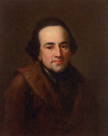

<table class="infobox biography vcard">
<tbody>
<tr>
<th colspan="2">

Moses Mendelssohn

</th>
</tr>
<tr>
<td colspan="2">

Portrait by&nbsp;<a title="Anton Graff" href="https://en.wikipedia.org/wiki/Anton_Graff">Anton Graff</a>&nbsp;(1773)

</td>
</tr>
<tr>
<th scope="row">Born</th>
<td>6 September 1729 

<a title="Dessau" href="https://en.wikipedia.org/wiki/Dessau">Dessau</a>

</td>
</tr>
<tr>
<th scope="row">Died</th>
<td>4 January 1786&nbsp;(aged&nbsp;56) 

<a title="Berlin" href="https://en.wikipedia.org/wiki/Berlin">Berlin</a>

</td>
</tr>
<tr>
<td colspan="2">&nbsp;</td>
</tr>
<tr>
<th scope="row">

Main interests

</th>
<td><a title="Philosophy of religion" href="https://en.wikipedia.org/wiki/Philosophy_of_religion">Philosophy of religion</a></td>
</tr>
<tr>
<th colspan="2">Signature</th>
</tr>
<tr>
<td colspan="2"></td>
</tr>
</tbody>
</table>
 

<strong>Moses Mendelssohn</strong>&nbsp;(6 September 1729&nbsp;&ndash; 4 January 1786) was a&nbsp;<a class="mw-redirect" title="German-Jewish" href="https://en.wikipedia.org/wiki/German-Jewish">German-Jewish</a>&nbsp;<a title="Philosopher" href="https://en.wikipedia.org/wiki/Philosopher">philosopher</a>&nbsp;to whose ideas the&nbsp;<em><a title="Haskalah" href="https://en.wikipedia.org/wiki/Haskalah">Haskalah</a></em>, the 'Jewish Enlightenment' of the eighteenth and nineteenth centuries, is indebted.

Born to a poor Jewish family in&nbsp;<a title="Dessau" href="https://en.wikipedia.org/wiki/Dessau">Dessau</a>,&nbsp;<a title="Principality of Anhalt" href="https://en.wikipedia.org/wiki/Principality_of_Anhalt">Principality of Anhalt</a>, and originally destined for a&nbsp;<a title="Rabbi" href="https://en.wikipedia.org/wiki/Rabbi">rabbinical</a>&nbsp;career, Mendelssohn educated himself in&nbsp;<a title="Germany" href="https://en.wikipedia.org/wiki/Germany">German</a>&nbsp;thought and literature and from his writings on philosophy and religion came to be regarded as a leading cultural figure of his time by both Christian and Jewish inhabitants of German-speaking Europe and beyond. He also established himself as an important figure in the Berlin&nbsp;<a title="Textile" href="https://en.wikipedia.org/wiki/Textile">textile</a>&nbsp;industry, which formed the foundation of his family's wealth.

His descendants include the composers&nbsp;<a title="Fanny Mendelssohn" href="https://en.wikipedia.org/wiki/Fanny_Mendelssohn">Fanny</a>&nbsp;and&nbsp;<a title="Felix Mendelssohn" href="https://en.wikipedia.org/wiki/Felix_Mendelssohn">Felix Mendelssohn</a>; Felix's son, chemist&nbsp;<a title="Paul Mendelssohn Bartholdy" href="https://en.wikipedia.org/wiki/Paul_Mendelssohn_Bartholdy">Paul Mendelssohn Bartholdy</a>; Fanny's grandsons,&nbsp;<a title="Paul Hensel" href="https://en.wikipedia.org/wiki/Paul_Hensel">Paul</a>&nbsp;and&nbsp;<a title="Kurt Hensel" href="https://en.wikipedia.org/wiki/Kurt_Hensel">Kurt Hensel</a>; and the founders of the&nbsp;<a title="Mendelssohn &amp; Co." href="https://en.wikipedia.org/wiki/Mendelssohn_%26_Co.">Mendelssohn &amp; Co.</a>&nbsp;banking house.

 

<h2> Books </h2>
<ul>
 <li><a target="_blank" href="https://github.com/manjunath5496/Moses-Mendelssohn-Books/blob/master/mos(1).pdf" style="text-decoration:none;">Last Works</a></li>
  
<li><a target="_blank" href="https://github.com/manjunath5496/Moses-Mendelssohn-Books/blob/master/mos(2).pdf" style="text-decoration:none;">Morning Hours: Lectures on God's Existence</a></li>  
  
<li><a target="_blank" href="https://github.com/manjunath5496/Moses-Mendelssohn-Books/blob/master/mos(3).pdf" style="text-decoration:none;">Moses Mendelssohn's Hebrew Writings</a></li>

 
<li><a target="_blank" href="https://github.com/manjunath5496/Moses-Mendelssohn-Books/blob/master/mos(4).pdf" style="text-decoration:none;">Phadon, or On the Immortality of the Soul</a></li>
                               
  <li><a target="_blank" href="https://github.com/manjunath5496/Moses-Mendelssohn-Books/blob/master/mos(5).pdf" style="text-decoration:none;"> Philosophical Writings </a></li>   

 <li><a target="_blank" href="https://github.com/manjunath5496/Moses-Mendelssohn-Books/blob/master/mos(6).rar" style="text-decoration:none;">Jerusalem, or on Religious Power and Judaism</a></li>
               
 </ul>

        
